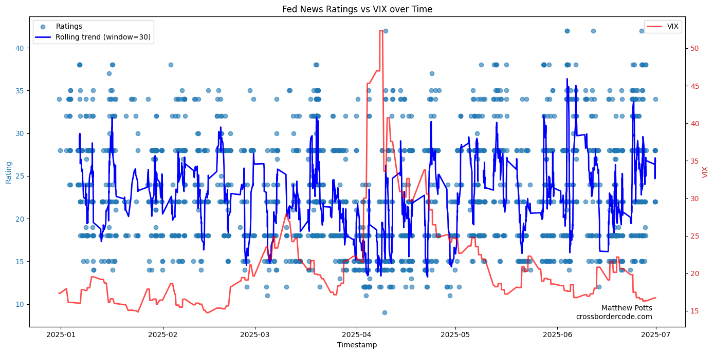

# Using LLMs for Global Macroeconomic Sentiment Analysiss: An Application to the Global Financial Cycle
<small>*10 November 2025*</small>

In 2013, Helene Rey [identified the Global Financial Cycle](https://www.nber.org/papers/w21162) ('GFCy') to describe the observed co-movement of global capital flows, risky asset prices, and credit growth.

'Risk on' periods are associated with increases in the above variables, and subsequent 'risk off' periods are associated with their retrenchment, often resulting in an economic crisis in the afflicted country. Importantly, this co-movement is observed across a spectrum of relevant variables across the globe.

What drives this cycle? Rey subsequently [argued the source of the GFCy](https://academic.oup.com/restud/article/87/6/2754/5834728) to be U.S. monetary policy shocks. The 'single global factor' underlying the cycle is driven by changes in U.S. monetary policy, and therefore these changes drive the cycle.

The implication of this that instead of their existing a 'trilemma' where countries are forced to choose two out of monetary policy indepedence, an open capital account, and a fixed exchange rate, [there is instead a 'dilemma'](https://www.nber.org/papers/w21162): in the absence of capital controls, a country cannot have monetary sovereignty, regardless of the exchange rate regime.

Economists Boehm and Kroner have [added further nuance to this story](https://blogs.lse.ac.uk/usappblog/2025/06/25/how-news-about-the-us-economy-drives-global-financial-conditions/) by showing that it is not just U.S. monetary policy that drives the GFCy, but actually merely *news* about U.S. macroeconomic conditions can explain the co-movement.

Negative surprises regarding the U.S. economy increases investor risk-aversion. The GFCy occurs because this increase in risk-aversion occurs globally. The logic here is similar to the ['gamma' model of Gabaix & Maggiori](https://academic.oup.com/qje/article-abstract/130/3/1369/1933306), which places investor risk-aversion as the central force in driving global capital flows.


## Data and Methodology
 
But how can we measure global investor risk-aversion, more directly at least then measuring simply effects of global risk aversion through changes in common indices such as the VIX?

A common prior workhorse approach involved conducting a sentiment analysis and analysing how the constructed index correlates with common risk-aversion measures. But the emergence of Large Language Models ('LLMs') offers a potentially fruitful avenue to move beynd this prior approach.

Indeed, applications of LLMs to text analysis has already been [explored in political science context](https://kenbenoit.net/pdfs/Benoit_etal_2025_AJPS.pdf) and a recent and relevant application of [LLMs to decompose macroeconomic sentiment](https://www.bis.org/publ/work1294.pdf).

This research note will, therefore, use LLMs construct sentiment scores of news articles, and regard these as a proxy for global investor risk aversion. I'll then measure the degree to which this proxy can explain the GFCy. My goal is to estimate the following equation:


*Model I*
$$
\Delta q_{i,t} = \alpha_{i} + \beta_{i} \cdot \gamma_{i,t} + \epsilon_{i,t}
$$

Where $\Delta q_{i,t}$ represents the change in asset prices in country $i$ at period $t$, and $\gamma_{i,t}$ LLM rating of story $i$ at time $t$. $\beta$ can therefore be interpreted as the sensitivity of asset price changes to the LLM rating, and a positive and statstically significant $\beta$ can be interpreted as evidence for investor risk-aversion affecting global asset prices (and hence the GFCy).

*Software Environment*

I develop a small Python-based [batch-processing application](https://github.com/matthew-potts/LLMs-MacroNews), integrated with a toy [SQLite3 database](https://docs.python.org/3/library/sqlite3.html) to conduct my analysis. This has several advantages over using a notebook or script. 

First, a batch-processing application makes transparent running the model with which parameters corresponds to which output, especially with runs orchestrated via a relational database. Second, the application can also be easily extended to additional models or topics. Finally, to scale the workload upwards, the application can more easily be packaged up, deployed to, and run on a remote server [^1].

*Data*

I use the [LSEG Python Data Library](https://developers.lseg.com/en/api-catalog/refinitiv-data-platform/refinitiv-data-library-for-python) to (programatically) extract data on both global asset prices and global macroeconomic news stories. The list of stock market indices included in the full analysis is:

| Country           | Index   | Category |
|-------------------|-----------| ----|
| Argentina         | .MERV     | Non-G7|
| Austria           | .ATX      | Non-G7|
| Belgium           | .BFX      | Non-G7|
| Brazil            | .BVSP     | Non-G7|
| Canada            | .GSPTSE   | G7|
| Switzerland       | .SSMI     | Non-G7|
| Chile             | .SPIPSA   | Non-G7|
| Czech Republic    | .PX       | Non-G7|
| Germany           | .GDAXI    | G7|
| Denmark           | .OMXC20   | Non-G7|
| Spain             | .IBEX     | Non-G7|
| Finland           | .OMXHPI   | Non-G7|
| France            | .FCHI     | G7|
| United Kingdom    | .FTSE     | G7|
| United States     | .NDX      | G7|
| Japan             | .TOPX     | G7|
| Italy             | .FTMIB    | G7|


One advantage of text-based analysis is that the impact of news regarding certain *topics* can be assessed. For each run, therefore, I obtain important news articles within the sample period for 3 core topics [^2]: The U.S. Federal Reserve; Trade Policy and Tariffs; and assessments of a global recession.

I conduct an event-study, analysing the immediate response of asset price ${i}$ to macroeconomic news after a certain perod, which itself is configurable via ```_MARKET_DATA_PERIOD_HOURS``` . Practically, this also helps to save on API calls in a rate-limited environment, as only the market data immediately following major news stories is required.

*LLM Choice*

LLMs can be broadly sub-divided into three categories: proprietary, open-weight, and open-source. I favour using OpenAI's proprietary GPT-4o and GPT-5-mini models, accessed through the [OpenAI SDK](https://github.com/openai/openai-python). These are proprietary models which are found to be particularly powerful on account of their being found to be the most powerful.

Following [some prior research](https://kenbenoit.net/pdfs/Benoit_etal_2025_AJPS.pdf), the baseline analysis involves instructing the LLM to provide an intermediate summary of a given news article and then classifying the implications of the article content for global asset prices on a scale of 1-7, with 7 being the most benign. The prompt and use of intermediate summaries are configurable.

To control for stochastic variability in LLM responses, I set the ```temperature``` parameter to 0 across the board, which encourages more deterministic outputs [^3].

To increate the speed of batch runs, I leverage [OpenAI's Batch API](https://platform.openai.com/docs/api-reference/batch/create), which allows the concurrent processing of multiple LLM-driven jobs.[^4]

<!-- The below schematic provides a high-level overview of the technical architecture of this project-->

## Results

Figure I below presents some initial exploratory findings from the results of the study, plotting a 30-point rolling trend of GPT-4o (the baseline model) assessments of news stories regarding the Federal Reserve against the VIX volatility index, an established proxy for global risk appetite.

*Figure I: Time Series of Macroeconomic Sentiment against Global Risk Proxies*



Although there is a substantial amount of noise, there appears to be at least a weak negative relationship between the LLM assessment of macroeconomic news and this particular global risk-proxy, which would support our hypothesis.

In the dataset feeding this particular graph, the ratings produced by LLM assessment tends to bunch around particular values (e.g. 15, 22 etc.). This lack of variability might be addressed by: (i) increasing the 'temparature' setting of the model; (ii) using a  more powerful model (e.g. GPT-5-mini); or (iii) encouraging the variability of output within the prompt itself.

*Regression Results*


**Tables I, II, and III: Responsiveness of Global Asset Prices to Macroeconomic News Assessment by Model**
|   Country Set      | GPT-4o | GPT-5 Mini|
|---------------|-------------|----------------|
|    Full    |      0.62 (0.94)     |   -1.13 (0.64)|
|    G7  |      0.66 (0.39)     |   1.49 (0.087)*|
|    Non-G7  |      0.92 (0.78)     |   0.03 (0.96)|

<small> Topic: 'U.S. Federal Reserve' </small>


|   Country Set      | GPT-4o | GPT-5 Mini|
|---------------|-------------|----------------|
|    Full    |      0.87 (0.94)     |   0.89 (0.49)|
|    G7  |      0.54 (0.27)     |   0.39 (0.91)|
|    Non-G7  |      1.12 (0.58)     |   0.97 (0.044)**|

<small> Topic: 'Global Trade' </small>

Tables I and II above presents the results from running Model I for a variety of topics and across different subsets of the index space. There is substantial variability acrosss the specification. The key finding is that the $\beta_{i}$ coefficient is typically positive but not statistically significant, indicating no meaningful relationship between the LLM assessments of a particular news story and the change in global asset prices - although the coefficient is of the suggested sign. 

Whilst these results are indeed variable and provide no strong support for the hypothesis tested in this piece, there are certain interesting granular results. For example, the $\beta_{i}$ coefficient in the 'Fed/GPT-5-mini/Developed' specification is positive (1.49) and statistically significant at the 10% level, providing evidence that negative news stories can provide forward-looking information about the direction of future asset prices when viewed from an LLM.

**Discussion**

There are many ways through which this project could be extended.

First, only two topics of interest - the U.S. Federal Reserv and Global Trade - have been considered as here. One natural extension would be to replicate the analysis for news articles, covering a different topic; for example, the 'AI bubble', which has [greatly influenced equity markets in 2025](https://www.ft.com/content/3e411742-b6bb-40c2-9432-4ee6f562af8f).

Second, from a technical perspective, for convenience the OpenAI Batch SDK was used to run the analysis, which has necessitated using OpenAI models exclusively. A natural next step would involve leveraging the [LangChain](https://www.langchain.com/) API to switch between models of different providers.

*Matthew Potts*


[^1]: I don't believe that fully remote batch runs are currently possible, however, due to the Refinitiv APIs relying on which itself can only be run locally. This means that fully automated trading is more difficult, and is a limitation of the LSEG API compared with, for example, TWS, for which there is an open-source library facilitating [headless runs of the IB Web API Gateway](https://github.com/Voyz/ibeam?tab=readme-ov-file).

[^2]: The driver application can be used to extend the analysis to other topics.

[^3]: Deterministic sampling would normally be achieved by setting the random seed to a configurable value. As of the time of this analysis, however, the 'seed' parameter used to achieve this has been deprecated in the OpenAI SDK. See: https://platform.openai.com/docs/api-reference/chat/get.

[^4]: The choice to use is one necessitated by the lack of interoperability between OpenAI's Batch platform and other ...