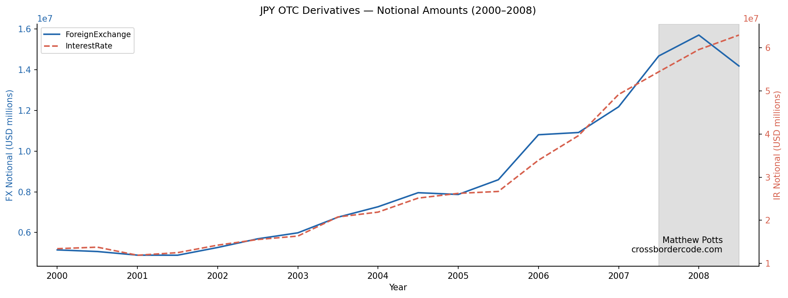
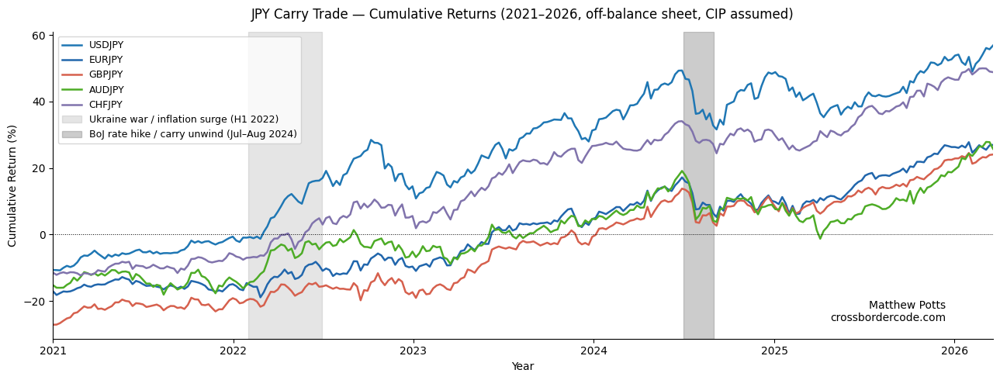
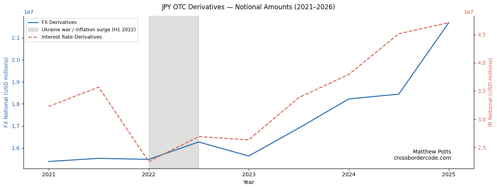
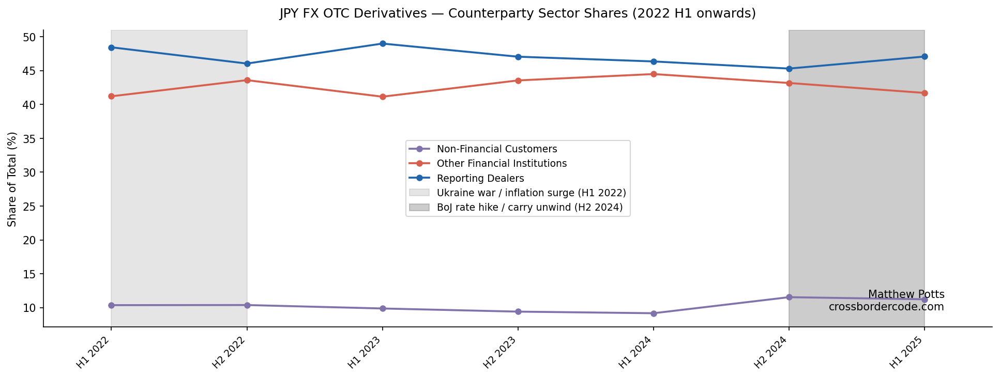

### Breaking Down the Reversal of the Off-Balance Sheet Yen Carry Trade since 2022
<small>*26 Mar 2026*</small>

Leafing through the [latest BIS Quarterly Review](https://www.bis.org/publ/qtrpdf/r_qt2512.htm) (December 2025), the institution presents its latest installment of a series presenting its unique datasets of financial data, this time [presenting its OTC derivative statistics](https://www.bis.org/publ/qtrpdf/r_qt2512d.pdf).

It may be instructive to expand on the authors' very insightful yet brief commentary on one particular aspect of OTC derivatives: namely, the off-balance sheet yen-funded carry trade, using the [*getBISy* Python SDK](https://test.pypi.org/project/getBISy/), which supports interacting with the [BIS Data Portal's](https://data.bis.org/) OTC deriatives data.

#### The Off-Balance Sheet Carry Trade

The 'textbook' version of the carry trade occurs *on* the balance sheet: borrow cash in a low interest rate currency (the 'funding' currency), swap this cash for that of a higher interest rate currency (the 'investment' currency), and invest this at the higher interest rate. This strategy leads to positive returns if the exchange rate of the investment currency appreciates against the funding currency.

The *off-balance sheet* carry trade is discussed less often. In this variant, derivatives are used. 


Formally, it can be demonstrated in the following way: let $S_0$ be the USDJPY spot rate (i.e. USD per 1 JPY at time 0), and F be the forward rate agreed. For the first step, the bank exchanges \$1 for $\$1/S_{0}$ JPY. Then, in the second step, it immediately sells the $\$1/S_{0}$ JPY it received, receiving back \$1, with a net unchanged cash position. The outstanding obligation is to deliver $\$1/S_{0}$ JPY at T under the forward leg, receiving $F/S_{0}$ USD. The profit $\pi$ from this strategy, assuming that Covered Interest Parity (CIP) holds, is given as[^1][^2]:

$$
\pi = \frac{F - S_T}{S_0} 
$$

The trade is profitable whenever $F$ exceeds the realised spot rate $S_T$ — that is, whenever the funding currency depreciates by more than the interest differential implies, or depreciates at all. This is exactly where Uncovered Interest Parity (UIP) breaks down: UIP predicts that the expected appreciation of the low-yield funding currency offsets the rate differential, leaving no expected profit. Empirically, though, the yen has tended to depreciate rather than appreciate, which is why carry returns have been [persistently positive](https://www.sciencedirect.com/science/article/abs/pii/0304393284900461?via%3Dihub).

#### The Yen-Funded Carry Trade

A carry trade strategy in which the yen serves as the [funding currency was particularly popular](https://www.bis.org/publ/qtrpdf/r_qt0709e.pdf) in the years leading up to the Great Financial Crisis 2007-08 (GFC), with Japanese interest rates persistently lower than those associated with many target currencies. Indeed, we can indirectly view the relative magnitudes of off-balance sheet yen-funded carry trade transactions through OTC derivatives market [^3], here using the [BIS Stats API](https://stats.bis.org/api-doc/v2/0) (accessed here using [*getBISy*](https://test.pypi.org/project/getBISy/)).


```python
df = data.get_otc_derivatives_data(
    freq='H',
    derivative_type=enums.OtcDerivativeType.NotionalAmounts,
    instrument=enums.OtcDerivativeInstrument.All,
    risk_category=enums.OtcDerivativeRisk.ForeignExchange,
    currency_leg1='JPY',
    currency_leg2='TO1',
    maturity=enums.OtcMaturity.All,
    basis=enums.OtcBasis.NetNet
)
```



In the aftermath of the GFC, major developed central banks embarked on sustained policies of expansionary monetary policy, dragging base interest rates towards zero. As such, the opportunities for yen-funded carry trades targeting major developed currencies largely disappeared.

That changed from 2022, when central banks outside Japan began raising rates aggressively to combat inflation. With this widening of interest rate differentials, the returns to the yen-funded carry trade increased in turn. Below illustrates a clear increase in returns to the off-balance sheet yen-funded carry trade, the time at which interest rate differentials started widening.



The above figure also outlines the potential pitfalls of this strategy. In mid-2024, the BoJ unexpectedly raised rates, leaving those who were short yen exposed, as demonstrated by the second grey block in the chart.

Imprints of the increase in yen-funded carry trade activity are again shown in the OTC derivatives market, picking up after 2022 when the trade became more profitable.



But this aggregate picture hides an important compositional shift. The initial surge in OTC FX derivative activity was led by Non-Bank Financial Institutions (NBFIs), consistent with speculative positioning to exploit the widening interest rate differentials triggered by the 2022 inflation shock. Following the BoJ's unexpected rate hike in mid-2024, the composition shifted: reporting dealers increased their share relative to NBFIs, consistent with hedging-driven demand as dealers intermediated and absorbed the unwinding of speculative carry trade positions.

f

Given narrowing yield differentials between Japan and other developed economies, and the [likelihood that these might persist](https://www.wsj.com/economy/central-banking/bank-of-japan-sees-natural-rate-gradually-rising-signaling-room-for-hikes-28b9c61e?gaa_at=eafs&gaa_n=AWEtsqePOuRaHfpefmtapW119LW-yffPGtuUvrTFCf-6nDZVYxwrLBvTLMaPkpcbG58%3D&gaa_ts=69c93634&gaa_sig=PbcQb0refy22VeHwbyumeDj5Ln2i-xrpi5dUVRTx0OKgMVIcx-6sxI0Vd1UbdrXfDh7Nqm0_KbxtHzR7yF2fQA%3D%3D) into the future, it may be expected that this increasing trend of an unwinding of the carry trade might continue.


*Matthew Potts*

crossbordercode.com


[^1]: I recommend reading the authors' exposition of this strategy in the "Cross-Currency Basis Trades and Carry Trades" for a more intuitive, informal account: https://www.bis.org/publ/qtrpdf/r_qt2512d.pdf.
[^2]: This assumption is kept for simplicity; in reality, deviations from CIP are a [recognised feature](https://www.bis.org/publ/work592.pdf) of the post-GFC period.
[^3]: As noted by the authors, viewing the carry trade through the prism of OTC derivatives, can only provide a rough understanding of their overall dynamics.