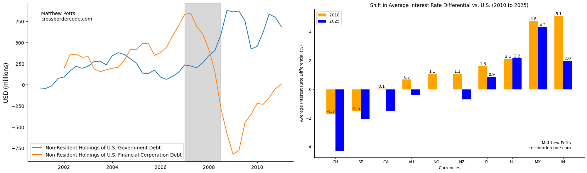

#### February 2026
- [Technical Note: Race Conditions in Batch LLM Assessment and Messaging Workflows](technical-notes/RaceConditions_LLM.md)

#### November 2025
- [Using LLMs To Analyse the Effect of U.S. Macroeconomic News: An Application to the Global Financial Cycle](../research/LLMsAndGFCy/LLMsAndGFCy.md)

#### October 2025
- [Has the U.S. Dollar's Position as a Global Safe Asset Diminished in 2025?](../research/BBBAndEURUSDCorrelation/BBBAndUSDSafeAsset.ipynb)

#### September 2025

- [Foreign Capital Flows and the U.S. Dollar During the Global Financial Crisis 2007-08](../research/U.S.Assets.DuringGFC/U.S.Assets.During.Crisis.ipynb)

#### August 2025
- [The Changing Nature of Cross-Border Credit: Through the BIS API and the getBISy Package](../research/BankLendingVsCapitalMarkets/BankLendingVsCapitalMarkets.ipynb)